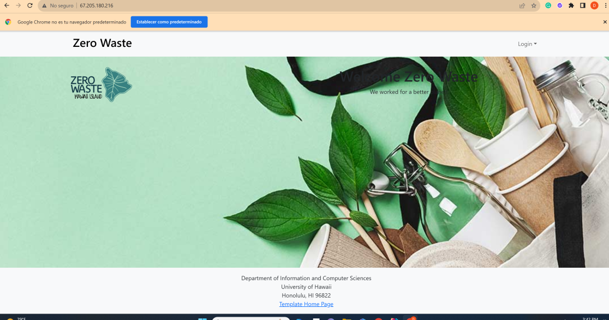
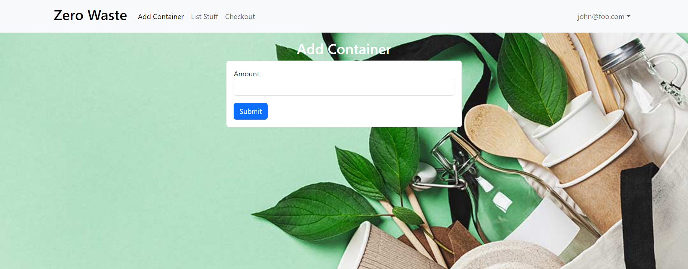

## Overview

The application will allow the vendor to keep track of the distribution of containers, making inventory management easier. It will also assist in monitoring the number of containers checked out, simplifying the return process for users. This will help the vendor to easily identify who has returned the containers and who has not

## Team Members

### Jordan

### Micah

### Carolina

### Reynald

### Elijah

## What is Zero Waste?

Problem: A non-profit organization operating a reusable takeout container program to replace single-use plates at events are losing 20-30% of containers.

The Solution: A way to keep customers accountable for returning the company's reusables by creating an app or website that tracks the reusable containers and holds each container into a database.

## Logging In / Signing Up

This is what the page looks like when you make a new account as well as signing up.

## Main Page

Once logged in, you get your container count, which are provided by the company. It is going to have a background in the final. 

This number cannot just be changed by changing the value

## Add / Checkout

The Add and Check out pages should also be somewhat similar. The difference being how they manipulate the database. 

## Contract link

Google Doc: [5stack Contract](https://docs.google.com/document/d/1d8_uQh5tRcIG5yzwuxLhPaZy40JoRs0NsppXXmh5sM4/edit?usp=sharing).
